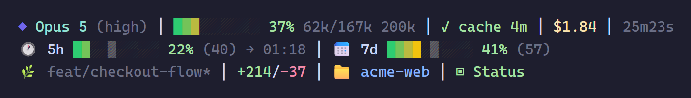
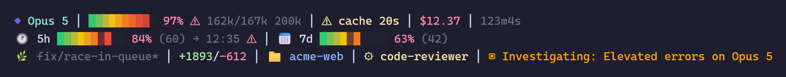
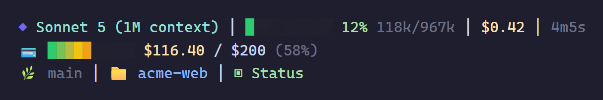

# claude-status-line

A three-line status line for [Claude Code](https://docs.claude.com/en/docs/claude-code/statusline) that shows everything you need to glance at while working: context left before auto-compact, prompt-cache TTL, session cost, plan usage against where you *should* be, git state, and live Claude service status.



It's plain bash + `jq`, works on macOS, Linux and Windows (Git Bash), and never blocks on the network: remote data is fetched by a detached background collector and cached.

## What it shows

**Line 1: session**

| Segment | Meaning |
| --- | --- |
| `◆ Opus 5` | Current model |
| Context bar + `37%` | Context used, **scaled so 100% = the auto-compact threshold** (window size minus a 33k buffer), not the raw window. It tells you how long until compaction. Green → yellow → orange → red, with a `⚠` at 90%. |
| `62k/167k 200k` | Tokens in context / compact threshold, plus the window size |
| `✓ cache 4m` | Prompt cache time-to-live. Turns yellow in the last 30s and red (`✗ cache`) once cold. Hidden if Claude Code doesn't report it. |
| `$1.84` | Session cost (yellow at $5, red at $10) |
| `25m23s` | Session duration |

**Line 2: plan usage**

| Segment | Meaning |
| --- | --- |
| `🕐 5h` bar `22% (40) → 13:35` | 5-hour window usage. The number in brackets and the shaded marker cell are the **expected** usage if you spread it evenly over the window. The colour tells you how far ahead of that pace you are. Then the reset time. |
| `📅 7d` bar `41% (57)` | Same thing for the 7-day window, where each day's allowance unlocks at the start of the day |
| `💳` bar `$116.40 / $200` | Enterprise accounts, which have no 5h/7d windows, get their monthly credit spend instead |

**Line 3: workspace**

| Segment | Meaning |
| --- | --- |
| `🌿 feat/checkout-flow*` | Git branch, `*` when there are uncommitted changes (cached for 5s per workspace) |
| `+214/-37` | Lines added/removed this session |
| `📁 acme-web` | Current directory |
| `⚙ code-reviewer` | Active subagent or worktree, if any |
| `▣ Status` | [status.claude.com](https://status.claude.com): green when healthy, otherwise the worst unresolved incident, coloured by impact |

### Under pressure

Context close to compaction, cache about to expire, 5h usage well ahead of pace, and an ongoing incident:



### Enterprise



## Requirements

- Claude Code
- `bash` (on Windows, the Git Bash that Claude Code already uses)
- [`jq`](https://jqlang.org/download/)
- `curl` (optional; without it the service status and enterprise usage are skipped)
- A font with emoji support. A [Nerd Font](https://www.nerdfonts.com/) is optional.

## Install

### Quick install

```bash
curl -fsSL https://raw.githubusercontent.com/WisteriaLabs/claude-status-line/main/install.sh | bash
```

### From a clone

```bash
git clone https://github.com/WisteriaLabs/claude-status-line.git
cd claude-status-line
./install.sh
```

The installer:

1. copies `statusline.sh` and `statusline-collector.sh` into `~/.claude` (or `$CLAUDE_CONFIG_DIR`)
2. adds a `statusLine` entry to `~/.claude/settings.json`, leaving everything else as it is
3. backs up any file it replaces as `*.bak-<timestamp>`

Restart Claude Code, or start a new session, and the status line appears.

### Manual install

Copy both scripts into `~/.claude/` (they must sit side by side) and add this to `~/.claude/settings.json`:

```json
{
  "statusLine": {
    "type": "command",
    "command": "bash ~/.claude/statusline.sh",
    "timeout": 10,
    "refreshInterval": 5
  }
}
```

### Uninstall

```bash
./install.sh --uninstall
```

## Configuration

Set these environment variables before starting Claude Code, e.g. in your shell profile or in the `env` block of `settings.json`:

| Variable | Effect |
| --- | --- |
| `CLAUDE_STATUSLINE_ASCII=1` | Plain ASCII: no emoji or block characters |
| `CLAUDE_STATUSLINE_NERDFONT=1` | Nerd Font glyphs for the timer and cost |
| `CLAUDE_STATUSLINE_POWERLINE=1` | Powerline separators (on by default with `NERDFONT`) |
| `CLAUDE_STATUSLINE_NO_TRUECOLOR=1` | 16-colour mode for terminals without truecolor |

Thresholds such as `AUTOCOMPACT_BUFFER`, `CACHE_WARN_SECS` and `COLLECT_TTL` are constants near the top of each section in `statusline.sh`.

## How it works

Claude Code runs `statusline.sh` every few seconds and pipes session JSON (model, context window, cost, rate limits, prompt cache…) to it on stdin. The script parses it with a single `jq` call and prints three lines of ANSI-coloured text.

Anything that needs the network goes through `statusline-collector.sh`. When the cache in `$TMPDIR/claude-statusline/` is more than 2 minutes old, the status line spawns the collector fully detached and renders with whatever is cached right now. The collector:

- fetches unresolved incidents from `status.claude.com`
- fetches plan usage from the Claude OAuth usage endpoint, using the token Claude Code stores in `~/.claude/.credentials.json`, **only** when Claude Code's own input carries no rate limits (e.g. Enterprise). The token is sent only to `api.anthropic.com`.

A lock directory makes sure concurrent sessions don't all fetch at once.

## Regenerating the screenshots

The screenshots come from the sample inputs in [`examples/`](examples/). To render them again after changing the script:

```bash
bash scripts/render-screenshots.sh   # needs python + Pillow and Chrome/Edge
```

## Credits

Built on ideas and code from [kcchien/claude-code-statusline](https://github.com/kcchien/claude-code-statusline) (layout and gradient bars) and [Djentinga/claude-statusline](https://github.com/Djentinga/claude-statusline) (context scaling, usage pacing, prompt cache and service status).

## License

[MIT](LICENSE)
